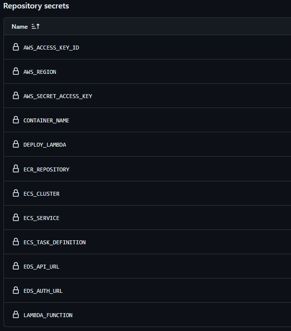
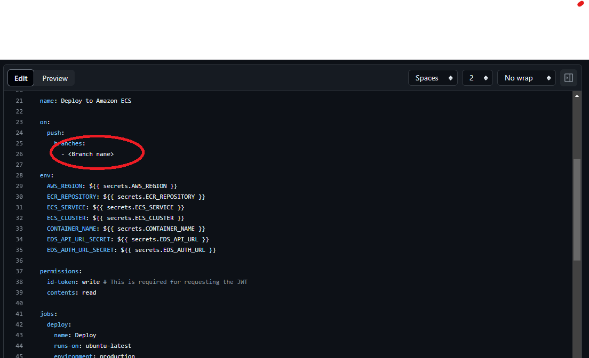
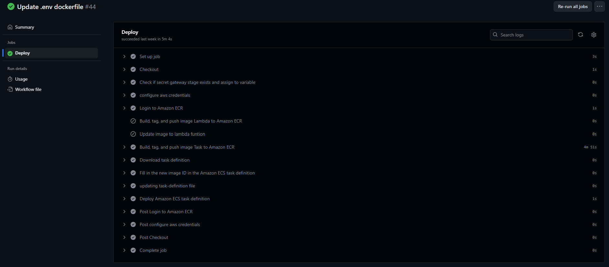

# AWS ECS Deployment guide

The following sections will guide you through the steps to setup a GitAction workflow to deploy the Reflectance Datacube processor on AWS ECS.

Before starting the deployment configuration, please make sure to check the [prerequisite section](Prerequisite.html).

Infrastructure setup is detailed on the [provisioning section](Provisioning.html).

## Clone repository

Please clone the Reflectance Datacube Processor on your Github account. 

Detailed process is available [here](https://docs.github.com/en/repositories/creating-and-managing-repositories/creating-a-repository-from-a-template).

## Ressources creation

Please refer to [here](./Provisioning.html) to create the ressources needed and use the option 2: ECS.

## Github repo configuration
Before configuring the deployment workflow, set the deployment variables in the GitHub repository secrets for actions. The workflow requires these variables in order to successfully push the image.




| Secret  | Description   |
|---|---|
| AWS_REGION | This is the AWS region you are targeting for deployment  |
| CONTAINER_NAME | Name of the container |
| ECR_REPOSITORY  | Container registry to publish your image  |
| ECS_CLUSTER  | ECS Cluster for container deployment   |
| ECS_SERVICE  | ECS Service for container deployment  |
| ECS_TASK_DEFINITION  | ECS Task definition for container deployment   |
| EDS_API_URL | Base URL to access EarthData Store  |
| EDS_AUTH_URL |  Base authentication URL to access EarthData Store (information regarding this information [here](./Provisioning.html#earthdaily-authentication)) |
| AWS_ACCESS_KEY_ID  |  S3 Access key to push datacube assets |
| AWS_SECRET_ACCESS_KEY |  S3 Secret Access key to push datacube assets |
| DEPLOY_LAMBDA |  Boolean value to enable Lambda deployment (deplyoed to ECS if false) |

## Deployment workflow
Whithin the Github repository, in the '.github/workflows, you will find a file AWS_deploy.yml

Edit the file by adding the branch name you want to deploy.




The file should be as below:

```yaml
name: Deployment AWS

on:
  push:
    branches:
      - deploy1

env:
  AWS_REGION: ${{ secrets.AWS_REGION }}
  ECR_REPOSITORY: ${{ secrets.ECR_REPOSITORY }}
  ECS_SERVICE: ${{ secrets.ECS_SERVICE }}
  ECS_CLUSTER: ${{ secrets.ECS_CLUSTER }}
  CONTAINER_NAME: ${{ secrets.CONTAINER_NAME }}
  EDS_API_URL: ${{ secrets.EDS_API_URL }}
  EDS_AUTH_URL: ${{ secrets.EDS_AUTH_URL }}
  LAMBDA_FUNCTION: ${{ secrets.LAMBDA_FUNCTION }}
  GATEWAY_STAGE: ${{ secrets.GATEWAY_STAGE }}
  AWS_ACCESS_KEY_ID: ${{ secrets.AWS_ACCESS_KEY_ID }}
  AWS_SECRET_ACCESS_KEY: ${{ secrets.AWS_SECRET_ACCESS_KEY }}
  DEPLOY_LAMBDA: ${{ secrets.DEPLOY_LAMBDA }}

permissions:
  id-token: write # This is required for requesting the JWT
  contents: read

jobs:
  deploy:
    name: Deploy
    runs-on: ubuntu-latest
    environment: production

    steps:
      - name: Checkout
        uses: actions/checkout@v3

      - name: Check if secret gateway stage exists and assign to variable
        id: gateway-key
        run: |
          if [[ -n "${{ env.GATEWAY_STAGE }}" ]]; then
            echo "::set-output name=key_gateway_stage::${{ env.GATEWAY_STAGE }}"
          else
            echo "::set-output name=key_gateway_stage::\"\""
          fi
        shell: bash

      - name: configure aws credentials
        uses: aws-actions/configure-aws-credentials@v4
        with:
          role-to-assume: arn:aws:iam::489065051964:role/GitHubActionProcessor-AssumeRoleWithAction #change to reflect your IAM role’s ARN
          role-session-name: GitHub_to_AWS_via_gitaction_devOps
          aws-region: ${{ env.AWS_REGION }}

      - name: Login to Amazon ECR
        id: login-ecr
        uses: aws-actions/amazon-ecr-login@v2

      - name: Build, tag, and push image Lambda to Amazon ECR
        id: build-image-lambda
        if: ${{ env.DEPLOY_LAMBDA == 'true' }}
        env:
          ECR_REGISTRY: ${{ steps.login-ecr.outputs.registry }}
          IMAGE_TAG: ${{ github.sha }}
        run: |
          # Build a docker container and
          # push it to ECR so that it can
          # be deployed to ECS.      
          docker build \
            --build-arg EDS_API_URL=${{ env.EDS_API_URL }} \
            --build-arg EDS_AUTH_URL=${{ env.EDS_AUTH_URL }} \
            --build-arg AWS_ACCESS_KEY_ID=${{ env.AWS_ACCESS_KEY_ID }} \
            --build-arg AWS_SECRET_ACCESS_KEY=${{ env.AWS_SECRET_ACCESS_KEY }} \
            --build-arg INPUT_JSON_PATH="data/processor_input_example.json" \
            --build-arg GATEWAY_STAGE=${{ steps.gateway-key.outputs.key_gateway_stage }} \
            -t $ECR_REGISTRY/$ECR_REPOSITORY:$IMAGE_TAG . -f Dockerfile_lambda
          # docker tag $ECR_REPOSITORY:latest $ECR_REGISTRY/$ECR_REPOSITORY:latest
          docker push $ECR_REGISTRY/$ECR_REPOSITORY:$IMAGE_TAG
          echo "image=$ECR_REGISTRY/$ECR_REPOSITORY:$IMAGE_TAG" >> $GITHUB_OUTPUT

      - name: Update image to lambda funtion
        id: lambda-function
        if: ${{ env.DEPLOY_LAMBDA == 'true' }}
        env:
          ECR_REGISTRY: ${{ steps.login-ecr.outputs.registry }}
          IMAGE_TAG: ${{ github.sha }}
        run: |
          aws lambda update-function-code \
          --function-name $LAMBDA_FUNCTION \
          --image-uri $ECR_REGISTRY/$ECR_REPOSITORY:$IMAGE_TAG

      - name: Build, tag, and push image Task to Amazon ECR
        id: build-image
        if: ${{ env.DEPLOY_LAMBDA != 'true' }}
        env:
          ECR_REGISTRY: ${{ steps.login-ecr.outputs.registry }}
          IMAGE_TAG: ${{ github.sha }}
        run: |
          # Build a docker container and
          # push it to ECR so that it can
          # be deployed to ECS.      
          docker build \
            --build-arg EDS_API_URL=${{ env.EDS_API_URL }} \
            --build-arg EDS_AUTH_URL=${{ env.EDS_AUTH_URL }} \
            --build-arg AWS_ACCESS_KEY_ID=${{ env.AWS_ACCESS_KEY_ID }} \
            --build-arg AWS_SECRET_ACCESS_KEY=${{ env.AWS_SECRET_ACCESS_KEY }} \
            --build-arg INPUT_JSON_PATH="data/processor_input_example.json" \
            --build-arg GATEWAY_STAGE=${{ steps.gateway-key.outputs.key_gateway_stage }} \
            -t $ECR_REGISTRY/$ECR_REPOSITORY:$IMAGE_TAG . -f Dockerfile_ECS
          # docker tag $ECR_REPOSITORY:latest $ECR_REGISTRY/$ECR_REPOSITORY:latest
          docker push $ECR_REGISTRY/$ECR_REPOSITORY:$IMAGE_TAG
          echo "image=$ECR_REGISTRY/$ECR_REPOSITORY:$IMAGE_TAG" >> $GITHUB_OUTPUT
          echo "::set-output name=IMAGE_URI::$ECR_REGISTRY/$ECR_REPOSITORY:$IMAGE_TAG"

      - name: Download task definition
        if: ${{ env.DEPLOY_LAMBDA != 'true' }}
        run: |
          aws ecs describe-task-definition --task-definition fastapiprocessor --query taskDefinition > task-definition.json
          echo $(cat task-definition.json | jq 'del(
                    .taskDefinitionArn,
                    .requiresAttributes,
                    .compatibilities,
                    .revision,
                    .status,
                    .registeredAt,
                    .registeredBy
                )') > task-definition.json
          cat task-definition.json

      - name: Fill in the new image ID in the Amazon ECS task definition
        id: task-def
        if: ${{ env.DEPLOY_LAMBDA != 'true' }}
        uses: aws-actions/amazon-ecs-render-task-definition@v1
        with:
          task-definition: task-definition.json
          container-name: ${{ env.CONTAINER_NAME }}
          image: ${{ steps.build-image.outputs.image }}

      - name: updating task-definition file
        if: ${{ env.DEPLOY_LAMBDA != 'true' }}
        run: cat ${{ steps.task-def.outputs.task-definition }}

      - name: Deploy Amazon ECS task definition
        if: ${{ env.DEPLOY_LAMBDA != 'true' }}
        uses: aws-actions/amazon-ecs-deploy-task-definition@v1
        with:
          task-definition: ${{ steps.task-def.outputs.task-definition }}
          service: ${{ env.ECS_SERVICE }}
          cluster: ${{ env.ECS_CLUSTER }}
          wait-for-service-stability: true1

```
In this deployment workflow, the workflow will be triggered on each commit of the selected branch. To enable the workflow to be triggered manually, you need to configure the `workflow_dispatch` event. 

At the beginning of the deployment yaml file, please replace 


```yaml
on:
  push:
    branches:
      - deploy1
```
by 

```yaml
on: workflow_dispatch
```

You can manually trigger a workflow run using the GitHub API, GitHub CLI, or [GitHub browser interface](https://docs.github.com/en/actions/using-workflows/manually-running-a-workflow). 

## Deployment workflow execution

On every commit change, workflow is triggered and executed. Go to the actions sections of the repository and you should see the execution steps and status.

.

## More resources

Here is additional content related deployment:
   - [Deploying to ECS with GitActions](https://docs.github.com/en/actions/deployment/deploying-to-your-cloud-provider/deploying-to-amazon-elastic-container-service)
   - [ECS Deployments](https://medium.com/@octavio/ecs-deployments-with-github-actions-dd34beed6528)