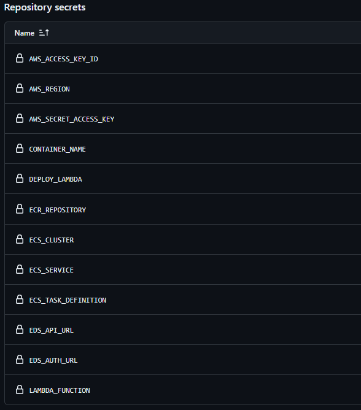

# AWS ECS Deployment guide

The following sections will guide you through the steps to setup a GitAction workflow to deploy the Reflectance Datacube processor on [AWS Lambda](https://aws.amazon.com/fr/pm/lambda/?gclid=Cj0KCQjw0MexBhD3ARIsAEI3WHKHFIwpgJl1S8X0Brj35ffpgeqoxbbMuqzSE_5beUpN6smZBPArjosaApH_EALw_wcB&trk=e0e0d4be-47fe-4336-ab69-7eece7f3d36e&sc_channel=ps&ef_id=Cj0KCQjw0MexBhD3ARIsAEI3WHKHFIwpgJl1S8X0Brj35ffpgeqoxbbMuqzSE_5beUpN6smZBPArjosaApH_EALw_wcB:G:s&s_kwcid=AL!4422!3!652240143523!e!!g!!amazon%20lambda!19878797032!147151597893).

## Github repo configuration
Before configuring the deployment workflow, set the deployment variables in the GitHub repository secrets for actions. The workflow requires these variables in order to successfully push the image.

.

| Secret  | Description   |
|---|---|
|  AWS_REGION | This is the AWS region you are targeting for deployment  |
|  CONTAINER_NAME | Name of the container |
| ECR_REPOSITORY  | Container registry to publish your image  |
| ECS_CLUSTER  | ECS Cluster for container deployment   |
| ECS_SERVICE  | ECS Service for container deployment  |
| ECS_TASK_DEFINITION  | ECS Task definition for container deployment   |
|  EDS_API_URL | Base URL to access EarthData Store  |
|  EDS_AUTH_URL |  Base authentication URL to access EarthData Store |

## Deployment workflow
Whithin the Github repository, in the '.github/workflows, you will find a file ECS_deploy.yml

Edit the file by adding the branch name you want to deploy.

.

## Deployment workflow execution

On every commit change, workflow is triggered and executed. Go to the actions sections of the repository and you should see the execution steps and status.

.

## More resources

Here is additional content related deployment:
   - [Deploying to ECS with GitActions](https://docs.github.com/en/actions/deployment/deploying-to-your-cloud-provider/deploying-to-amazon-elastic-container-service)
   - [ECS Deployments](https://medium.com/@octavio/ecs-deployments-with-github-actions-dd34beed6528)