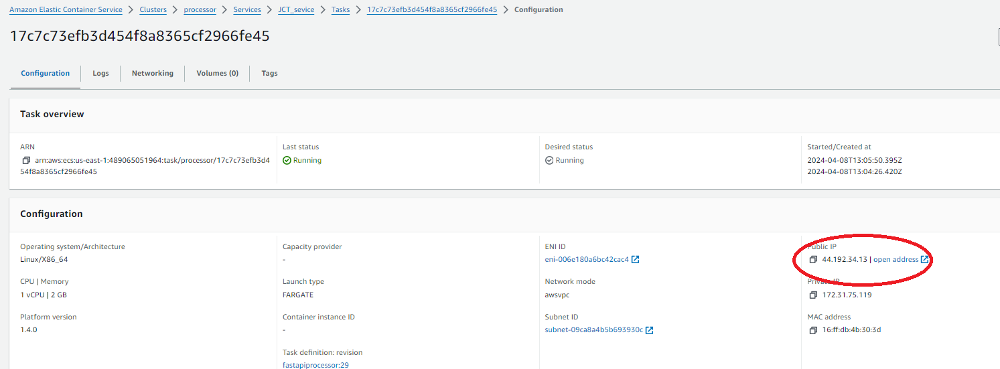
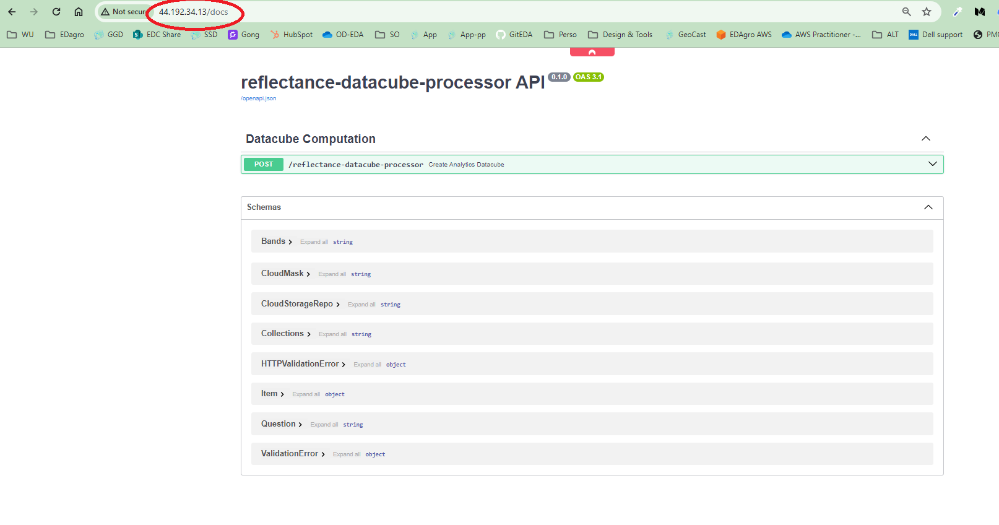
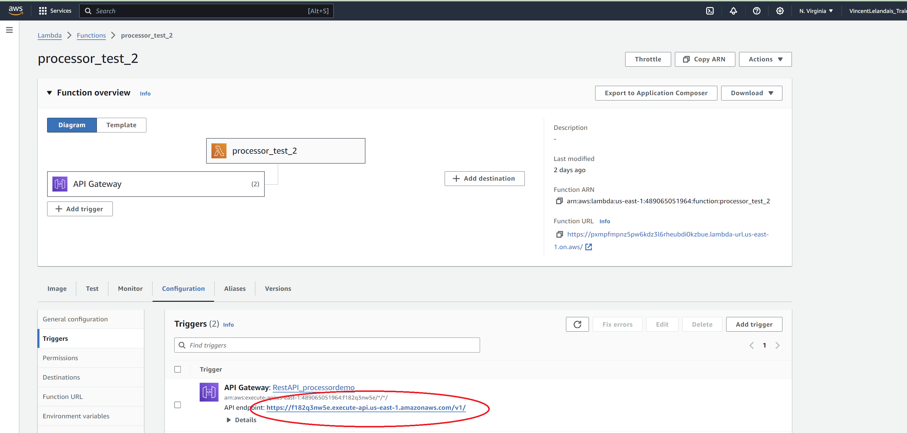
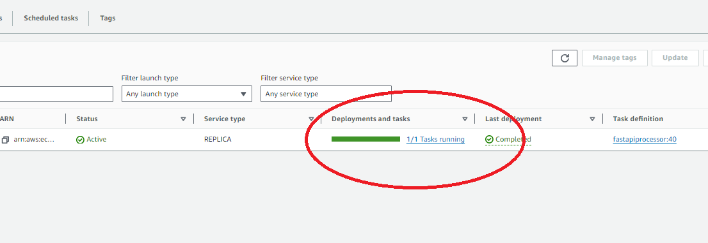
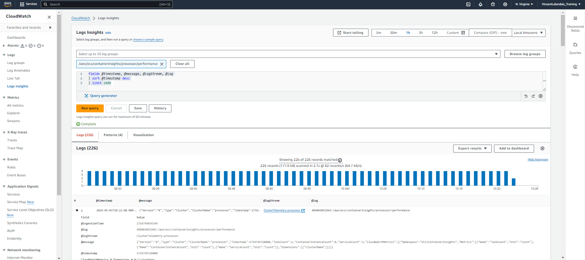
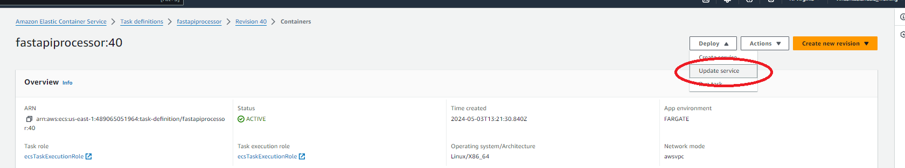

# Processor lifecycle management

## Health check

### Run ECR image locally

Please make sure to have docker and Python installed locally (see [Pre requisites](https://earthdaily.github.io/reflectance-datacube-processor/2.%20Prerequisite.html))

Open terminal and get [AWS CLI](https://pypi.org/project/awscli/)

1. Get authenticated to your AWS account (you will need to get an access key ID and Secret Access Key) using the command `aws configure`

2. ECR authentication

    ```shell
    aws ecr get-login-password --region <AWS REGION> | docker login --username AWS --password-stdin <AWS_ACCOUNT_ID>.dkr.ecr.<AWS REGION>.amazonaws.com
    ```
3. Pull image from ECR 

    ```shell
    docker pull <AWS_ACCOUNT_ID>.dkr.ecr.<AWS REGION>.amazonaws.com/<ECR)REPOSITORY>:<CONTAINER_TAG>
    ```

4. Once image is available locally, please follow [user guide](https://earthdaily.github.io/reflectance-datacube-processor/5.%20User%20guide.html) to run the procossor

### Get access to API from ECS

Open your AWS Console and select ECS service. Navigate to your cluster, then service and finally task running your container. On configuration section of the screen you will find the public IP to access the service. 




Use this public IP and add  "/docs" to access the Open API page.




Then you can use the API as described [here](reflectance-datacube-processor/User%20guide.html#api-mode)

### Get access to API from API Gateway

Open your AWS Console and select Lambda service. Navigate to your function. On configuration section of the screen you will find the public URL to access the function. 




Use this public URL and add  "/docs" to access the Open API page.


Then you can use the API as described [here](User%20guide.html#api-mode)

## Maintenance

### Routine maintenance
The processor is not using system credentials and the authentication to the EarthDatastore is managed as part of the execution context as part of parameter send in the request.

Standard update will be published on the processor Github repository, users are accountable to run standard testing process before deploying. Release note will be provided [here](Release-notes.html).

If you have any question regarding your EarthDataStore credentials and license, please contact our [sales team](edagro-sales@earthdaily.com). 

In order to avoid unexpected infrastructure cost, you could consider implementing serive quotas on your account leveraging [AWS Service Quotas](https://us-east-1.console.aws.amazon.com/servicequotas/home?region=us-east-1#)

We recommend following best practices for the AWS credentials, and rotate the credentials used in GitHub Actions workflows regularly.

Please also monitor the activity of the credentials used in GitHub Actions workflows.

### Emergency maintenance

In case of service outage, here is the troubleshooting process:

- Login to your AWS console
- Go to the ECS service and select your cluster
- Check that the task is running 



- Go to CloudWatch and select Log Insgiths
- Select your cluster in the group and Click *"Run query"*



- Run your root cause analysis based traces
- If a source code update is required, please create a ticket [here](reflectance-datacube-processor/User%20guide.html#support)

If you need to restore service leveraging a previous task definition, please go the ECS service and select *Task definition*, then select a previous version and update your ECS Processor service.



## Backup and recovery
For backup,please be sure to keep the various images of your service in the configured ECR repository. We recommend that you tag your images using the git SHA for the git commit that was used to build the image.

ECR repo will enable restoration of any version of your service.

## Costs

The use of this processor is free but it will rely on infrastructure to run.

If you are using the ECS deployment model, it will leverage the following billable AWS sercices:
 - Identity and Access Management (IAM)
 - Elastic Container Registry (ECR)
 - Elastic Container Service (ECS)
 - Virtual Private Cloud (VPC)
 - Cloud watch 
 - Simple Storage Service (S3)


To manage running cost, you can define service limits leveraging [AWS service quotas](https://docs.aws.amazon.com/AmazonECS/latest/developerguide/service-quotas.html#service-quotas-fargate). For example you can control Fargate capacity like number of vCPUs running concurrently in the current region.


### Additional Information

For any additional information, please contact our [support team](Api.Support@geosys.com)

The following link might provide interesting information:
- ...


