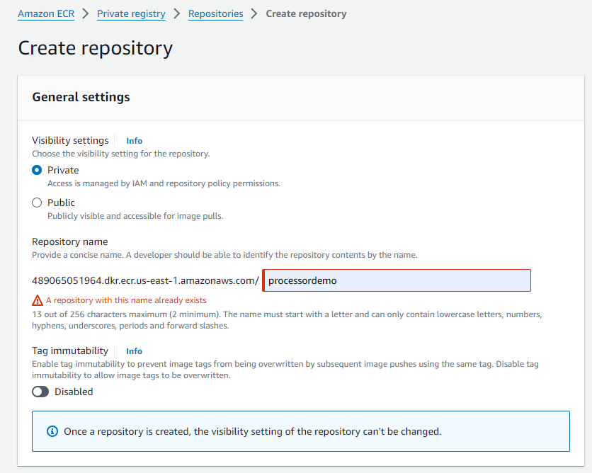
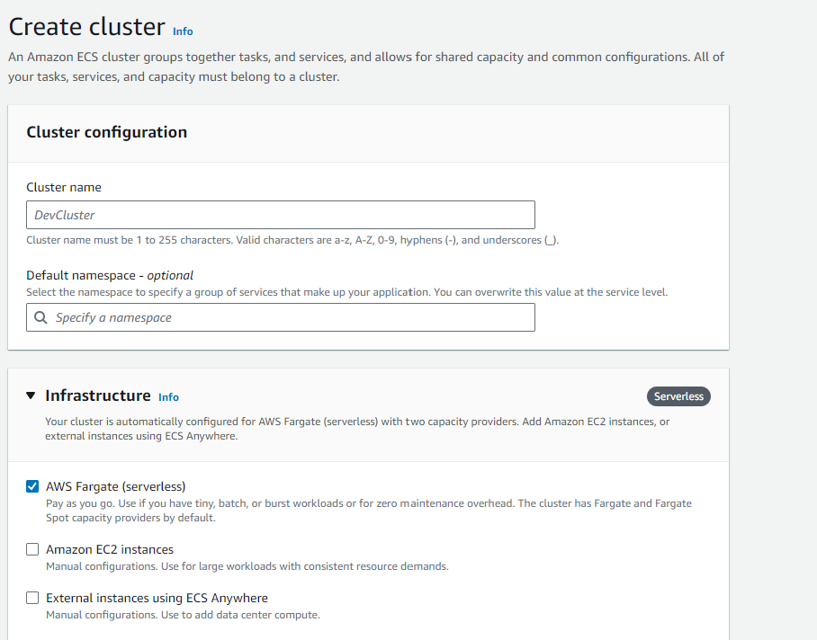
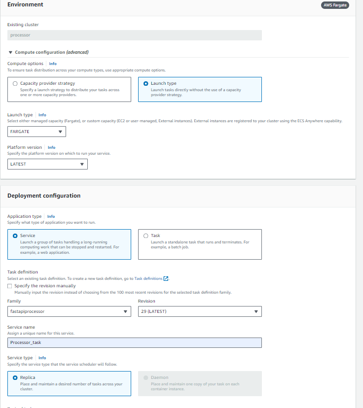
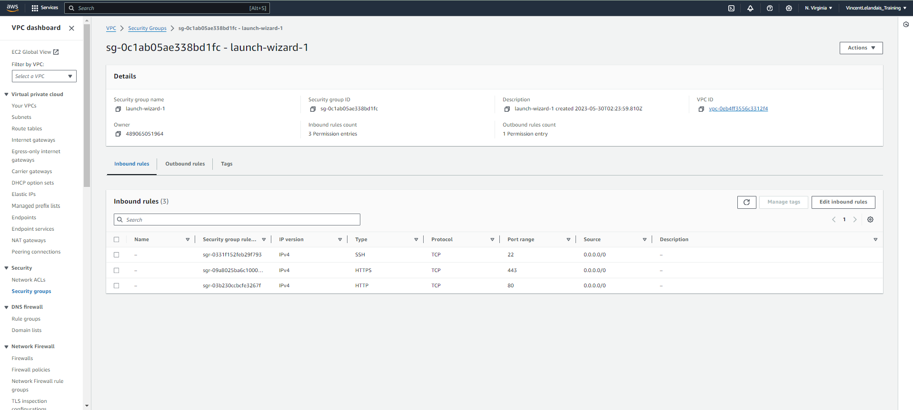
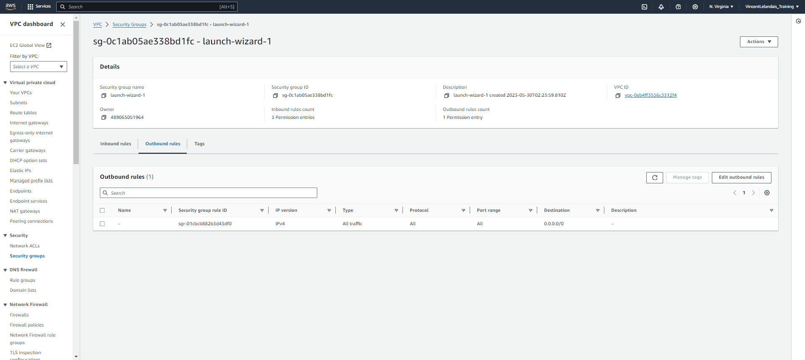
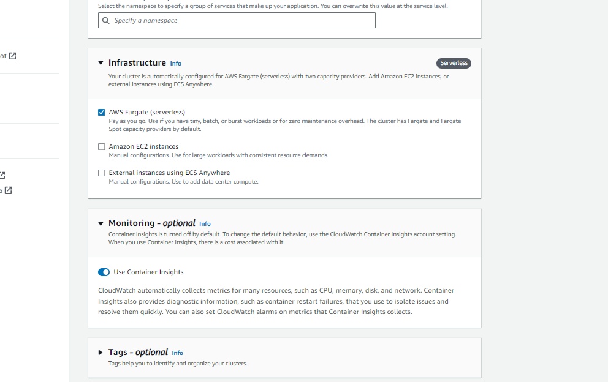

# AWS Resources provisioning

Within code snippets, variables will be between <>. For example '<AWS_REGION>' will be the AWS region code, you are using for the deployment.

## Manual setup

Resources provisioning is following Amazon [IAM best practices](https://docs.aws.amazon.com/IAM/latest/UserGuide/best-practices.html) for the AWS credentials used in GitHub Actions workflows, including:

 - not storing credentials in your repository's code. You may use GitHub Actions secrets to store credentials and redact credentials from GitHub Actions workflow logs.
- using an individual IAM user with an access key for use in GitHub Actions workflows, preferably one per repository. Do not use the AWS account root user access key.
- granting least privilege to the credentials used in GitHub Actions workflows. Grant only the permissions required to perform the actions in your GitHub Actions workflows (see below).
- Rotating the credentials used in GitHub Actions workflows regularly.
- Monitoring the activity of the credentials used in GitHub Actions workflows.

### Configure OpenID Connect
OpenID Connect (OIDC) allows your GitHub Actions workflows to access resources in Amazon Web Services (AWS), without needing to store the AWS credentials as long-lived GitHub secrets.

>❗Note: Support for custom claims for OIDC is unavailable in AWS.

#### Add identity provider to AWS IAM
To add the GitHub OIDC provider to IAM, see the [AWS documentation](https://docs.aws.amazon.com/IAM/latest/UserGuide/id_roles_providers_create_oidc.html).

 - For the provider URL, use `https://token.actions.githubusercontent.com`
 - For the "Audience": use `sts.amazonaws.com` if you are using the official action.

#### Configure role and trust policy

To configure the role and trust in IAM, see the AWS documentation ["Configure AWS Credentials for GitHub Actions"](https://github.com/aws-actions/configure-aws-credentials#configure-aws-credentials-for-github-actions) and ["Configuring a role for GitHub OIDC identity provider"](https://docs.aws.amazon.com/IAM/latest/UserGuide/id_roles_create_for-idp_oidc.html#idp_oidc_Create_GitHub)

Edit the trust policy, adding the `sub` field to the validation conditions and use `StringLike` with a wildcard operator (*) to allow any branch, pull request merge branch, or environment from the earthdaily/reflectance-datacube-processor organization and repository to assume a role in AWS. For example:

```json

{
    "Version": "2012-10-17",
    "Statement": [
        {
            "Effect": "Allow",
            "Principal": {
                "Federated": "arn:aws:iam:: require'<AWS_ACCOUNT_ID>' :oidc-provider/token.actions.githubusercontent.com"
            },
            "Action": "sts:AssumeRoleWithWebIdentity",
            "Condition": {
                "StringLike": {
                    "token.actions.githubusercontent.com:sub": "repo:earthdaily/reflectance-datacube-processor:*"
                },
                "StringEquals": {
                    "token.actions.githubusercontent.com:aud": "sts.amazonaws.com"
                }
            }
        }
    ]
}
```

>❗Note: AWS Identity and Access Management (IAM) recommends that users evaluate the IAM condition key, `token.actions.githubusercontent.com:sub`, in the trust policy of any role that trusts GitHub’s OIDC identity provider (IdP). Evaluating this condition key in the role trust policy limits which GitHub actions are able to assume the role.

#### Configure role

This action requires the following minimum set of permissions:

```json
{
   "Version":"2012-10-17",
   "Statement":[
      {
         "Sid":"RegisterTaskDefinition",
         "Effect":"Allow",
         "Action":[
            "ecs:RegisterTaskDefinition"
         ],
         "Resource":"*"
      },
      {
         "Sid":"PassRolesInTaskDefinition",
         "Effect":"Allow",
         "Action":[
            "iam:PassRole"
         ],
         "Resource":[
            "arn:aws:iam::<aws_account_id>:role/<task_definition_task_role_name>",
            "arn:aws:iam::<aws_account_id>:role/<task_definition_task_execution_role_name>"
         ]
      },
      {
         "Sid":"DeployService",
         "Effect":"Allow",
         "Action":[
            "ecs:UpdateService",
            "ecs:DescribeServices"
         ],
         "Resource":[
            "arn:aws:ecs:<region>:<aws_account_id>:service/<cluster_name>/<service_name>"
         ]
      }
   ]
}
```

This configuration follows the principle of the least privilege.

### Create a container registry
First sign in to your AWS console and select Elastic Container Register and Create a new private repository. 




>💡You can also use AWS CLI please see [documentation](https://docs.aws.amazon.com/cli/latest/reference/ecr/create-repository.html).

#### Load image to registry

Use the following steps to authenticate and push an image to your repository. For additional registry authentication methods, including the Amazon ECR credential helper, see [Registry Authentication](https://docs.aws.amazon.com/AmazonECR/latest/userguide/getting-started-cli.html).

   1. Retrieve an authentication token and authenticate your Docker client to your registry.
    Use the AWS CLI:

```yaml
aws ecr get-login-password --region **us-east-1** | docker login --username AWS --password-stdin 489065051964.dkr.ecr.us-east-1.amazonaws.com
```

>Note: If you receive an error using the AWS CLI, make sure that you have the latest version of the AWS CLI and Docker installed.

  2. Build your Docker image using the following command. For information on building a Docker file from scratch see the instructions here . You can skip this step if your image is already built:
```yaml
docker build -t processordemo .
```
  3. After the build completes, tag your image so you can push the image to this repository:

```yaml
docker tag processordemo:latest 489065051964.dkr.ecr.us-east-1.amazonaws.com/processordemo:latest
```

  4. Run the following command to push this image to your newly created AWS repository:

```yaml
docker push 489065051964.dkr.ecr.us-east-1.amazonaws.com/processordemo:latest
```

### ECS

#### Create an ECS Cluster

Sign in to your AWS console and select Elastic Container Service and create a new Cluster.

An ECS cluster is a grouping of EC2 instances or AWS Fargate tasks on which we’ll deploy and run our containers. Pick the name you want and left the default settings.



#### Create a task definition

A task definition defines the containers and resources required for the application to run. 

In the container details section give a name to the container, then grab the URI of the image in ECR. 

The name given will be needed later in the GitHub Actions workflow so keep it in mind. 

Another important note is to give the correct ports (I used port 8000) that are required for the application.

#### Create a service 
Within ECS, start by navigating to the clusters tab in ECS and create a service using the task definition. For compute configuration, choose “Launch type” and leave the default option for Fargate. For the deployment configuration, choose “Service” and then, choose the task definition with the latest revision. Then, navigate to the Networking section and ensure public IP is chosen (You can modify this later if you have specific networking requirements). Finally, create the service.



#### VPC and Network configuration for external access

A default VPC is automatically provisionned on every AWS account. It comes with a public subnet in each Availability Zone, an internet gateway, and settings to enable DNS resolution. For more information please see [here](https://docs.aws.amazon.com/vpc/latest/userguide/default-vpc.html).

This VPC also comes with default Security group. Please make sure to have the following configuration to enable external access to your processor. 





#### CloudWatch
In other to monitor and troubleshoot any issue with your processor, it is recommended to enabled [Container Insight]() while creating your ECS Cluster. 



For more information please see [here](https://docs.aws.amazon.com/AmazonECS/latest/developerguide/cloudwatch-metrics.html) 

### Lambda


## Script using Terraform


## Sizing
In order to keep, cost under control, we strongly encourage to implement service quotas using [AWS capabilities](https://docs.aws.amazon.com/general/latest/gr/aws_service_limits.html).


## More resources 

To learn the basic concepts of how GitHub uses OpenID Connect (OIDC), and its architecture and benefits, see "About security hardening with OpenID Connect."
