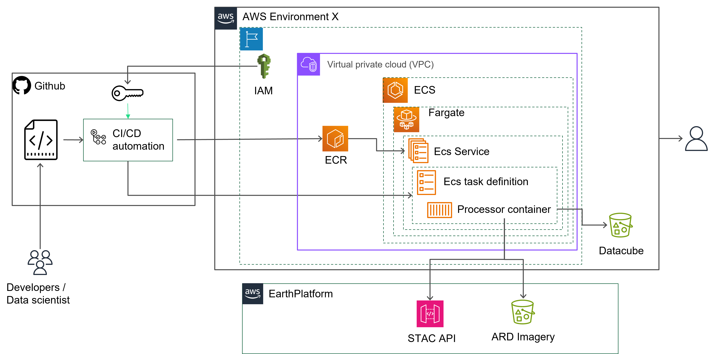

# Reflectance Datacube Processor

## Earthdaily processors 

## Use case

Earth Observation Image serves as a vital dataset for many applications, such as regenerative agriculture, insurance or food security and overall agriculture digitization.   Many models and decision support tools leverage cloud free pixel to remotely to extract information and knowledge on the status of the soil or the crop using a variety of spectral bands. 

The reflectance Datacube Processor will ease deployment of analysis ready pixel pipeline supporting modeling effort either at early stage with model design and training but also model serving with fresh and up to date pixels.

The reflectance datacube processor will ease the creation of pixel based on geometries of interest, without the need to download the full satellite images. The processor is leveraging cloud native geospatial capabilities to:
    - select pixels of interest based on temporal (date range) and spatial criterias (geometry)
    - select pixel within several image collections
        - Sentinel 2
        - Landsat 8/9
        - [Venµs](https://aws.amazon.com/marketplace/pp/prodview-qzaib3z674dbu)
    - Apply cloud filter to get only clear pixel
    - 
 

time series creation

Fast processsing worldwide coverage [Premium cloud mask](https://github.com/earthdaily/Studies-and-Analysis/tree/main/Auto-Cloud-Mask-Accuracy) and cross calibration

full flexibilty on data formating 

Crcucial for precision farming  crop monitoring feed models like yield model  de

## Architecture

### AWS ECS

This is the reference architecture for a deployment on ECS. 

.

