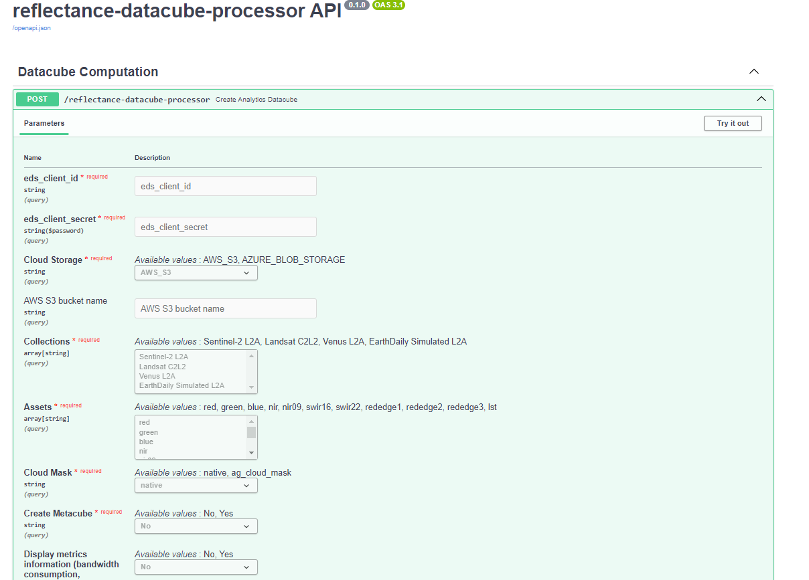

# Reflectance processor user guide

## Build Processor locally

Set up the project, follow these steps:

1. Clone the project repository:

    ```
    git clone https://github.com/earthdaily/reflectance-datacube-processor
    ```

2. Change the directory:

    ```
    cd earthdaily-data-processor
    ```

3. Fill the environment variable (.env)

Ensure that you populate the .env file with your credentials.
To access and use our Catalog STAC named EarthDataStore, please ensure that you have the following environment variables set in your .env file:

```
EDS_API_URL = https://api.eds.earthdaily.com/archive/v1/stac/v1
EDS_AUTH_URL = <eds auth url>
```
You can also specify the <code>EDS_CLIENT_ID</code> and <code>EDS_SECRET</code> direclty on the API. Those two parameters are not mandatory in the .env file. 

To publish results on cloud storage, please add your credentials allowing the processor to write outputs:

```
AWS_ACCESS_KEY_ID = <...>
AWS_SECRET_ACCESS_KEY = <...>
# Bucket name is optional.
AWS_BUCKET_NAME = <...> 

```

You can also specify the <code>AWS_BUCKET_NAME</code> direclty on the API.

<p align="right">(<a href="#top">back to top</a>)</p>


## API mode

To set up and run the project using Docker, follow these steps:

1. Build the Docker image locally:

    ```
    docker build --tag reflectancedatacubeprocessor .
    ```

2. Run the Docker container:

    ```
    docker run -e RUN_MODE_ENV=API -p 8100:80 reflectancedatacubeprocessor
    ```

3. Access the API by opening a web browser and navigating to the following URL:

    ```
    http://127.0.0.1:8100/docs
    ```

This URL will open the Swagger UI documentation, click on the "Try it out" button under each POST endpoint and enter the request parameters and body.

.


#### POST /reflectiance-datacube-processor

Parameters:

- EDS client id: this has been provided with your EarthPlatform account details
- EDS client secret: this has been provided with your EarthPlatform account details
- Cloud storage, ex: "AWS_S3"
- Collections, ex: "Venus-l2a"
- Assets, ex: "red"
- Cloud mask, ex: "native"
- Create metacube, ex: "no"
- Display metrics information, ex "yes"
- Clear coverage (%), ex: "80"

Body Example:

```json
{
  "geometry": "POLYGON ((1.26 43.427, 1.263 43.428, 1.263 43.426, 1.26 43.426, 1.26 43.427))",
  "startDate": "2019-05-01",
  "endDate": "2019-05-31",
  "EntityID": "entity_1"
}
```

Here is the API cURL

```json
curl -X 'POST' \
  'http://44.192.34.13/reflectance-datacube-processor?eds_client_id=66ksg23po0pp7pdv302ibinsoi&eds_client_secret=f1dlfqt1a0h0ona1mjjppjgmqbccena35u48np3v4pm561a0o27&Cloud%20Storage=AWS_S3&AWS%20S3%20bucket%20name=byoa-demo&Collections=Sentinel-2%20L2A&Collections=Landsat%20C2L2&Assets=red&Assets=green&Assets=nir&Cloud%20Mask=native&Create%20Metacube=Yes&Display%20metrics%20information%20%28bandwidth%20consumption%2C%20duration%29=Yes&Clear%20Coverage%20%28%25%29=100' \
  -H 'accept: application/json' \
  -H 'Content-Type: application/json' \
  -d '{
  "geometry": "POLYGON ((1.26 43.427, 1.263 43.428, 1.263 43.426, 1.26 43.426, 1.26 43.427))",
  "startDate": "2019-05-01",
  "endDate": "2019-05-31",
  "EntityID": "entity_1Documentation"
}'
```

Here is the response:

```json
{
  "storage_links": [
    "s3://byoa-demo/2019-05-01_2019-05-31_entity_1Documentation_datacube.zarr"
  ],
  "metrics": {
    "execution_time": "0 minutes 12 seconds",
    "data_generation_network_use": "0.057 Gb",
    "data_upload_network_use": "0.0 Gb"
  }
}
```

## Python package mode

Jupyter notebook are available in the [Github repository](https://github.com/earthdaily/reflectance-datacube-processor/tree/main/notebooks).

To use Jupyter Notebook of the project, please follow these steps:

1. Open a terminal in the earthdaily-data-processor folder.

2. Create the required Conda environment:

    ```
    conda env create -f environment.yml
    ```

3. Activate the Conda environment:

    ```
    conda activate earthdaily-processor
    ```

4. Open a jupyter notebook server:

    ```
    jupyter notebook --port=8080
    ```

5. Open the example notebook (datacube-sustainable-practices.ipynb) by clicking on it.

6. Run the notebook cells to execute the code example and plot results.

NB: To use the example notebooks, you need to generate the exemple datacubes.
They are described in each notebooks (the parameters not mentionned need to have the default value).

## Visualize and use Refletance datacube 


## Support

If you are experiencing unexpected behaviour or error while using this service, please create an [issue in the main repository](https://github.com/earthdaily/reflectance-datacube-processor/issues).

Another option is to create an account on the [Earthdaily Agro Service Desk](https://earthdailyagro.com/contact/)

Based on condition defined in your EarthPlatform agreement, you could be able to contact your account manager directly.

<p align="right">(<a href="#top">back to top</a>)</p>
